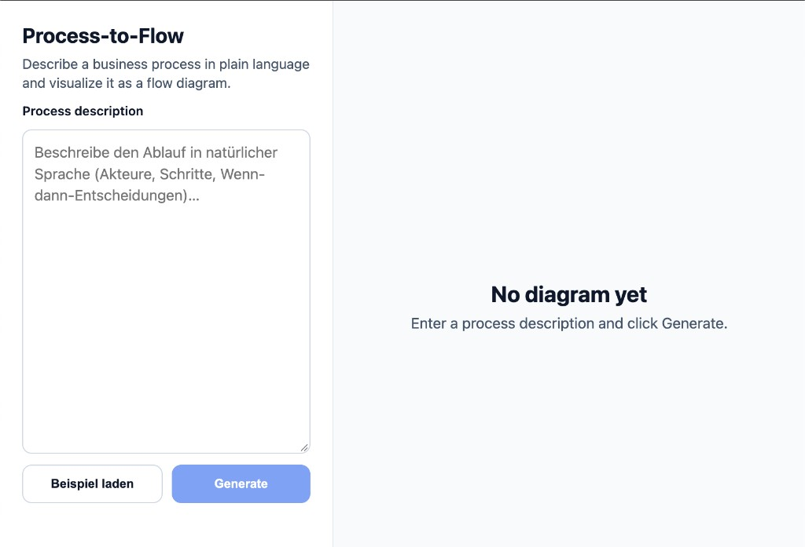

# Process-to-Flow

Natural-language business process descriptions → interactive flow diagrams (Spring AI + React Flow).

| | |
|---|---|
| **Live demo** | [process-to-flow.onrender.com](https://process-to-flow.onrender.com/) |
| **Repository** | [github.com/Pietsen/process-to-flow](https://github.com/Pietsen/process-to-flow) |



## What it does

1. Describe a process in plain language (actors, steps, decisions).
2. An LLM parses the text into structured steps and decisions.
3. The UI renders a flow diagram with tasks and decision nodes.

Portfolio prototype — in-memory storage, no authentication.

## Tech stack

- **Backend:** Java 21, Spring Boot 3, Spring AI (OpenAI or Ollama)
- **Frontend:** React 18, TypeScript, Vite, pnpm, [@xyflow/react](https://reactflow.dev/)
- **Deploy:** Docker (all-in-one image), [Render](https://render.com) blueprint in [`render.yaml`](./render.yaml)

## Quick start (local)

**Requirements:** Java 21, Maven, Node 20+, pnpm (`corepack enable`), or Docker.

```bash
git clone https://github.com/Pietsen/process-to-flow.git
cd process-to-flow
cp .env.example .env   # set OPENAI_API_KEY
```

**Docker Compose (UI + API):**

```bash
docker compose up --build
# UI http://localhost:5173 · API http://localhost:8080
```

**Dev mode:**

```bash
# terminal 1
cd backend && export OPENAI_API_KEY=... && mvn spring-boot:run

# terminal 2
cd frontend && pnpm install && pnpm dev
# http://localhost:5173 (proxies /api to :8080)
```

Use **Beispiel laden** in the UI or see [docs/example-prompt.md](./docs/example-prompt.md).

## Documentation

| Document | Audience |
|----------|----------|
| [docs/DEPLOY.md](./docs/DEPLOY.md) | Maintainers (Render, env vars) |
| [docs/example-prompt.md](./docs/example-prompt.md) | Sample process text |
| [docs/graph-verification.md](./docs/graph-verification.md) | Diagram quality checks |

## API (summary)

| Method | Path | Description |
|--------|------|-------------|
| `POST` | `/api/process` | `{ "description": "..." }` → `{ steps, decisions, actors }` |
| `GET` | `/api/processes` | List saved processes (in-memory) |
| `GET` | `/api/processes/{id}` | One saved process |

LLM configuration: `LLM_PROVIDER`, `OPENAI_*`, `OLLAMA_*` — see [`.env.example`](./.env.example) and `backend/src/main/resources/application.yml`.

## Production image (single URL)

```bash
docker build -t process-to-flow .
docker run --rm -p 8080:10000 -e PORT=10000 -e OPENAI_API_KEY process-to-flow
# http://localhost:8080
```

## License

[MIT](./LICENSE)
