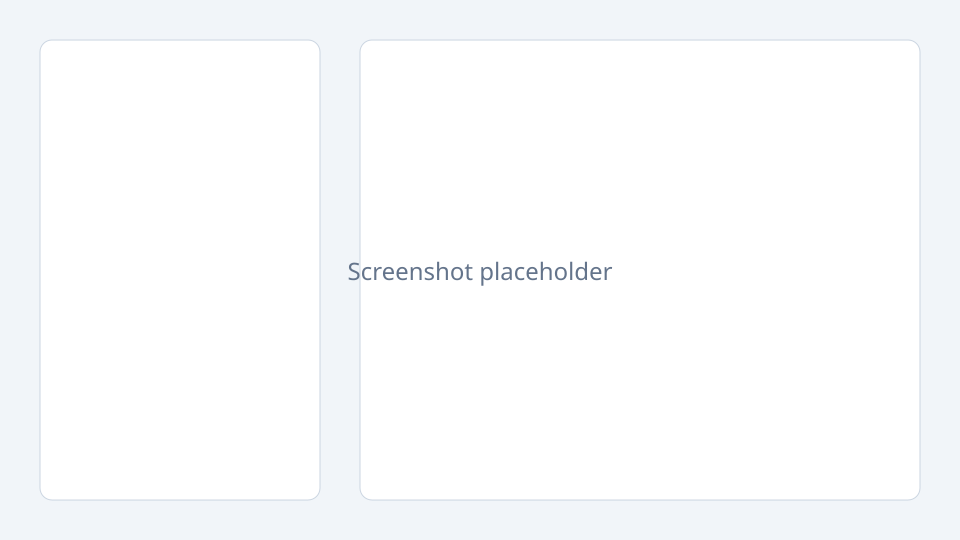

# Process-to-Flow

Turn natural-language business process descriptions into interactive flow diagrams powered by Spring AI and React Flow.



## Prerequisites

- Java 21
- Node.js 20+ and [pnpm](https://pnpm.io/) (enable via `corepack enable`)
- Docker & Docker Compose (optional)
- OpenAI API key **or** a local [Ollama](https://ollama.com/) instance

## Project structure

```
process-to-flow/
├── backend/          Spring Boot 3 + Spring AI REST API
├── frontend/         React 18 + TypeScript + Vite + React Flow
├── docker-compose.yml
└── README.md
```

## Run locally (without Docker)

### 1. Backend

```bash
cd backend
export OPENAI_API_KEY=your-key-here
# Optional: export LLM_PROVIDER=ollama
# Optional: export OLLAMA_BASE_URL=http://localhost:11434
mvn spring-boot:run
```

API runs at `http://localhost:8080`.

### 2. Frontend

```bash
cd frontend
pnpm install
pnpm dev
```

UI runs at `http://localhost:5173` and proxies `/api` to the backend during development.

A ready-made German example prompt lives in [docs/example-prompt.md](./docs/example-prompt.md) (or use **Beispiel laden** in the UI).

## Deploy for HR testers (one link, no local setup)

The simplest path: **one Docker image** (UI + API on the same URL). See **[docs/deploy-fuer-hr.md](./docs/deploy-fuer-hr.md)**.

Quick version:

1. Push the repo to GitHub.
2. [Render](https://render.com) → Blueprint from [`render.yaml`](./render.yaml).
3. Set secret `OPENAI_API_KEY`.
4. Share the `https://…onrender.com` URL with HR.

Local smoke test of the production image:

```bash
export OPENAI_API_KEY='your-key'
docker build -t process-to-flow .
docker run --rm -p 8080:10000 -e PORT=10000 -e OPENAI_API_KEY process-to-flow
# open http://localhost:8080
```

## Run with Docker Compose (development)

```bash
export OPENAI_API_KEY=your-key-here
docker compose up --build
```

- Frontend: http://localhost:5173
- Backend: http://localhost:8080

For Ollama on the host machine:

```bash
export LLM_PROVIDER=ollama
export OLLAMA_BASE_URL=http://host.docker.internal:11434
docker compose up --build
```

## Configure the LLM

Switch providers with `LLM_PROVIDER` in `backend/src/main/resources/application.yml` or via environment variables.

### OpenAI (default)

```yaml
spring:
  ai:
    model:
      chat: openai
    openai:
      api-key: ${OPENAI_API_KEY}
      base-url: ${OPENAI_BASE_URL:https://api.openai.com}
      chat:
        options:
          model: ${OPENAI_MODEL:gpt-4o-mini}
```

Environment variables:

- `OPENAI_API_KEY` (required for OpenAI)
- `OPENAI_BASE_URL` (optional)
- `OPENAI_MODEL` (optional)

### Ollama (local)

```yaml
spring:
  ai:
    model:
      chat: ollama
    ollama:
      base-url: ${OLLAMA_BASE_URL:http://localhost:11434}
      chat:
        options:
          model: ${OLLAMA_MODEL:llama3.2}
```

Environment variables:

- `LLM_PROVIDER=ollama`
- `OLLAMA_BASE_URL` (optional)
- `OLLAMA_MODEL` (optional)

Both OpenAI and Ollama starters are on the classpath; `spring.ai.model.chat` selects the active provider.

## API

### `POST /api/process`

Request:

```json
{
  "description": "Customer submits order. Finance checks credit. If approved, warehouse ships; otherwise support contacts customer."
}
```

Response:

```json
{
  "steps": [
    { "id": "s1", "label": "Submit order", "actor": "Customer", "type": "task" },
    { "id": "s2", "label": "Check credit", "actor": "Finance", "type": "task" },
    { "id": "s3", "label": "Ship order", "actor": "Warehouse", "type": "task" },
    { "id": "s4", "label": "Contact customer", "actor": "Support", "type": "task" }
  ],
  "decisions": [
    {
      "id": "d1",
      "label": "Credit approved?",
      "actor": "Finance",
      "yesBranch": "s3",
      "noBranch": "s4"
    }
  ],
  "actors": ["Customer", "Finance", "Support", "Warehouse"]
}
```

### `GET /api/processes`

Returns summaries of all generated processes stored in memory.

### `GET /api/processes/{id}`

Returns one stored process including the original parsed structure.

## Notes

- Storage is in-memory only (data is lost on restart).
- No authentication — portfolio prototype only.
